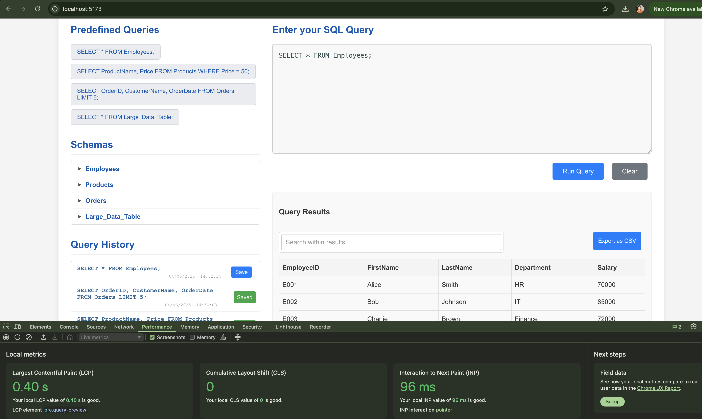

# SQL Query Runner

This is a web application designed to simulate running SQL queries and displaying results. Built with React, it offers features like query history, saving queries, and a schema viewer with intelligent input.

---

## 🎬 Walkthrough Video

Check out this short video (under 3 minutes) for a quick overview of the application, a walkthrough of its implementation details, and a demonstration of how to execute queries:

[Link to demo video](https://www.loom.com/share/d7b4e8a0df53431b97eb61cfbbad9c24?sid=413db342-56d1-4d73-9b0e-978d39d67e84)

[Link to deployed app](https://stunning-sunburst-7e0307.netlify.app/)

---

## 🚀 Technologies Used

This application is built using the following core technologies and libraries:

- **JavaScript Framework:**  
  **React (v18.x):** The primary JavaScript library for building the user interface, leveraging component-based architecture for modular and reusable UI elements.

- **Key Packages & Plugins:**.
  - **TypeScript (v5.x):** Adds static typing for improved code quality, readability, and maintainability.
  - **Vite (v5.x):** Our fast build tool, providing an optimized, native ES module-based development server.
  - **useReducer hook:** Extensively used for complex, predictable state management related to queries, history, and saved items.

---

## ⏱️ Page Load Time

I ensured a swift user experience with measured load times of approximately **0.4 seconds**.




### How it was measured:

- Opened the app in Chrome
- Launched DevTools (F12 or right-click -> Inspect)
- Navigated to the "Performance" tab
- Clicked "Record" or pressed Ctrl+E
- Refreshed the page or navigated to the app
- Stopped recording after load completion

I analyzed the "Largest Contentful Paint (LCP)" and "Time to Interactive (TTI)" metrics, along with network waterfall, DOMContentLoaded, and Load events for bottleneck assessment.

---

## ⚡ Performance Optimizations

Several strategies were employed to keep the application fast and responsive:

- **Code Splitting / Lazy Loading:**  
  Managed automatically by Vite during production builds, reducing initial download size and improving load times.

- **Virtualization with react-window:**  
  For large data tables (e.g., 50,000 rows), only visible rows are rendered, drastically decreasing DOM load and boosting rendering speed.

- **Efficient State Management:**  
  Utilized `useReducer` for predictable state transitions, alongside `useCallback` to memoize event handlers and helper functions, minimizing unnecessary re-renders.

- **Minimal Dependencies:**  
  Reduced external dependencies (avoided using react-simple-code-editor and prismjs for sql query editor) to keep it simple and optimize bundle size.

- **CSS Optimization:**  
  Dedicated CSS files per component and a global `App.css` ensure efficient bundling and consistent styling. Basic resets prevent layout shifts, improving perceived load speed.

---

## 🚀 Local Development

To get the project running locally:

### 1. Install dependencies
```
npm install
```
### 2. Start the development server
```
npm run dev
```
### 3. Run tests
```
npm run test
```

Make sure you have Node.js and npm installed.


